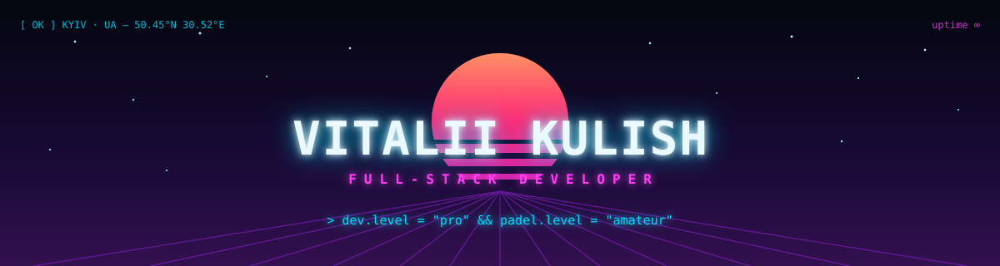
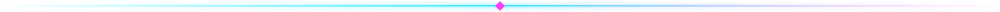

<!-- Synthwave · hand-crafted, not generated. На health, друже. -->

<div align="center">




</div>



## `~/about.json`

```txt
vitalii@kyiv:~$ cat about.json
{
  "handle":     "mancunianez",
  "name":       "Vitalii Kulish",
  "role":       "Full-Stack Developer @ Awesome Motive",
  "product":    "WPForms — the WordPress form builder",
  "side_quest": {
    "name":  "padelamateurs.com",
    "what":  "padel tournaments & open plays · Kyiv ↔ Warsaw",
    "stack": [ "Cloudflare Workers", "D1", "KV", "React", "MapLibre" ]
  },
  "based_in":   "Kyiv, Ukraine · UTC+3",
  "speaks":     [ "PHP", "TypeScript", "JavaScript", "SQL", "українська" ],
  "motto":      "ship fast · padel faster"
}
vitalii@kyiv:~$ █
```

## `~/now`

```txt
▸ shipping    wpforms features to millions of wordpress sites
▸ building    padelamateurs.com — kyiv & warsaw edition
▸ exploring   edge-first architecture on cloudflare workers
▸ playing     padel. badly. with passion. 🎾
```

## `~/stack.list`

<p>
  
  
  
  
  
</p>

<p>
  
  
  
  
</p>

<p>
  
  
  
  
</p>

<p>
  
  
  
  
</p>

## `~/contact.sh`

```bash
#!/bin/bash
echo "open to: cool problems & padel games"
ping padelamateurs.com     # side quest
mail -s "hello" vitalii    # mancunianez@gmail.com
```

<p>
  <a href="https://padelamateurs.com"></a>
  <a href="mailto:mancunianez@gmail.com"></a>
</p>

<div align="center">


<sub><i>// thanks for scrolling — see you on the padel court 🎾</i></sub>

</div>
